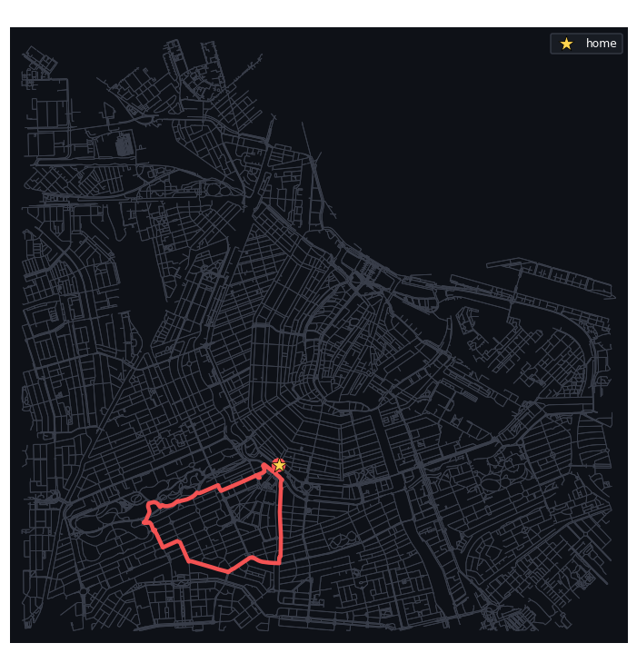
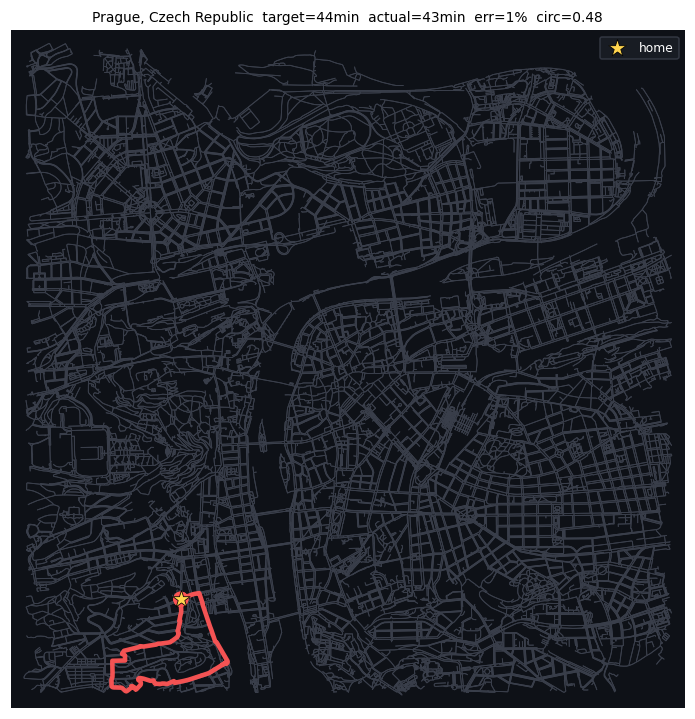
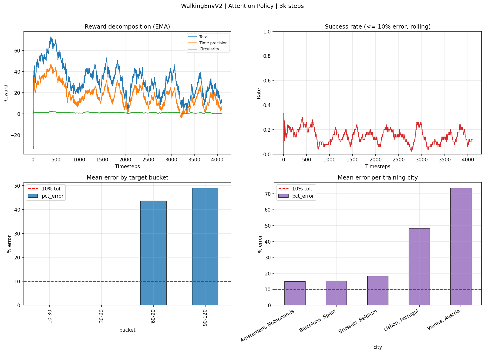

# Walking Loops: Reinforcement Learning for Circular Route Generation

> Tell it a city and how long you want to walk. It gives you back a loop that starts and ends at
> your door, lasts almost exactly that long, and it has never seen that city before.

An RL agent that plans **circular pedestrian routes on real OpenStreetMap graphs**, hitting a
user-specified target duration between 10 and 120 minutes. Trained with **MaskablePPO** on an
**attention-based pointer network** policy.

**Zero-shot on cities never seen during training: 7.24% mean duration error, 83% of loops within
10% of target.**

<table>
<tr>
<td width="50%"></td>
<td width="50%"></td>
</tr>
<tr>
<td align="center"><em><b>Amsterdam</b>, 58 min requested → <b>58 min delivered</b>. Exact, and the loop is a clean convex ring that never doubles back on itself.</em></td>
<td align="center"><em><b>Prague</b>, 44 min requested → <b>43 min delivered</b> (1% error, circularity 0.48). A wide, rounded loop that closes neatly on the starting point.</em></td>
</tr>
</table>

Look at the *shape*, not just the timing. Both routes leave home (the star), sweep a broad arc
through the neighbourhood and come back on a different side: no out-and-back spike, no tangle of
retraced streets. That is the loop actually looking like a walk you would want to take, and it is
what the circularity term in the reward is there to buy. These are among the best-shaped runs,
comfortably above the 0.102 mean circularity of the full benchmark.

The agent picks the sequence of waypoints and decides *when to turn back*. Nothing in the route is
hand-drawn, and no city-specific tuning is involved.

---

## Why this is not a shortest-path problem

Classical routing gives you the *fastest* way from A to B. This asks for the opposite: a route
that comes back to where it started, takes *a specific amount of time*, and looks like a walk
rather than a there-and-back. That combination is a **time-constrained orienteering problem**:
NP-hard, and the constraint that makes it hard (total duration ≈ target) is only known at the
*end* of the episode, which is exactly the credit-assignment setting RL is built for.

Three design decisions carry the result:

**1. The action space is a set, so the policy is set-native.**
Letting the agent pick any node of a 3 km pedestrian graph means tens of thousands of actions.
Instead each city is reduced to **80 candidate POIs**, and the policy is a *pointer network*
(Vinyals et al. 2015; Kool et al. 2019): every POI is embedded independently by a shared encoder,
the current state is embedded as a context vector, and the action logit for each POI is the
attention compatibility between context and POI. Adding a POI does not change the architecture,
and reordering the POIs does not change the output.

**2. The POIs are reshuffled every episode, on purpose.**
Action index *k* means a different place in every episode, so the agent cannot memorise "action 12
is the park". It is forced to read the POI features. This is adversarial to an MLP (which has to
relearn the meaning of each slot position) and free for attention, which is permutation-invariant
by construction. The MLP baseline was tried first and was measurably worse. 

**3. Generalisation is the metric, not training performance.**
The agent trains on 5 European cities with **error-weighted city sampling** (an exponential moving
average of per-city error decides how often each city is drawn, so hard maps get more attention),
and is evaluated **only on cities it has never seen**. The headline numbers below are all zero-shot.

---

## Results

Evaluation on 100 deterministic loops across 5 **unseen** cities, targets spanning 10–120 minutes.
A loop counts as a success when its duration is within 10% of the target.

| Metric | Value |
|---|---|
| Mean duration error | **7.24%** |
| Median duration error | **4.09%** |
| Success rate (≤10% error) | **83%** |
| Mean circularity | 0.102 |
| Mean edge revisit ratio | 0.265 |

Per city (20 loops each, none seen in training):

| City | Mean error | Success ≤10% |
|---|---|---|
| Prague, Czech Republic | 4.20% | 100% |
| Bruges, Belgium | 4.69% | 95% |
| Florence, Italy | 5.89% | 90% |
| Rome, Italy | 7.36% | 75% |
| Copenhagen, Denmark | 14.08% | 55% |

Error concentrates almost entirely in the **10–30 minute** bucket, where two POIs already consume
the whole budget and the graph geometry leaves little room to land on target. Above 60 minutes the
error drops to 1–2% in most cities.

---

## How it works

```
OSMnx pedestrian graph (3 km)  ──►  largest strongly connected component
                                     │
                                     ├─ 80 POIs sampled with distance-based bucketing
                                     └─ single-source Dijkstra from each key node → cached
                                                    │
                    ┌───────────────────────────────┴────────────────────────┐
                    │                                                        │
          context (13 dims)                                    POI set (80 × 5 dims)
    target, elapsed, time-home, budget,                 visited, Δx, Δy, travel time,
    urgency, home vector, 3 breadcrumbs                 round-trip feasibility
                    │                                                        │
                    └────────────►  multi-head cross-attention  ◄────────────┘
                                             │
                              logits = C · tanh(W_Q·ctx · W_K·poi / √d)
                                             │
                              ┌──────────────┴──────────────┐
                       pick next POI                   go home (end episode)
```

**Environment** ([`env.py`](src/walking_loops/env.py)) is a Gymnasium env with a discrete action space
of `80 POIs + 1 GO_HOME`. Action masking removes only what is semantically meaningless: already
visited POIs and the POI you are standing on. The task itself is never simplified by the mask.

**Reward**: dense shaping plus terminal precision.

| Term | When | Value |
|---|---|---|
| Exploration | per street crossed | +0.3 new node, −0.3 revisited node, −0.1 duplicate edge (clipped at −3) |
| Dense timing | every non-final step | `0.1 · max(0, 1 − 2·e_proj)`, where `e_proj` is the error you'd get by going home *now* |
| Terminal precision | on GO_HOME | `max(−30, 100 − 200·e)` |
| Shape bonus | on GO_HOME | `circularity · 25 · max(0, 1 − e/0.5)`, gated on timing, so shape never buys its way past a bad duration |
| Truncation | out of steps / way over target | −5 |

Circularity is computed from the enclosed loop area via the Shoelace formula.

**Curriculum** ([`train.py`](src/walking_loops/train.py)): targets open up in three phases,
`[60,120] → [30,120] → [10,120]`. Long loops are geometrically forgiving, so the agent learns loop
*structure* first and precision on short targets last.

**Training**: MaskablePPO (sb3-contrib), 16 parallel `SubprocVecEnv` workers, 5M timesteps,
constant `lr=1e-4`, `batch_size=512`. About **30 minutes end-to-end on an RTX 3090**, with BF16
autocast and `torch.compile` on the attention encoder.



---

## Quickstart

```bash
git clone <this-repo> && cd walking-loops
pip install -r requirements.txt

# Full training run (5M steps; downloads + caches the city graphs on first launch)
python -m walking_loops.train

# Quick sanity run on a laptop CPU (200k steps, 20 POIs, small model)
python -m walking_loops.train --debug

# Zero-shot benchmark on held-out cities → results/
python -m walking_loops.eval

# Tests
pytest
```

The first run downloads each city's pedestrian graph from OpenStreetMap and precomputes the
Dijkstra path matrix between the 81 key nodes. This is slow once and instant afterwards, and
everything lands in `cache/` (git-ignored). Trained checkpoints go to `models/` (also git-ignored,
so **train before you evaluate**).

---

## Layout

```
src/walking_loops/
  config.py       all hyperparameters, as frozen dataclasses (single source of truth)
  env.py          WalkingEnvV2: Gymnasium env, reward, action masking, curriculum API
  policy.py       attention encoder + pointer-network actor/critic, MaskablePPO integration
  train.py        curriculum callback, vectorised training loop, learning curves
  eval.py         deterministic zero-shot benchmark, per-city/per-bucket breakdown
  graph_utils.py  OSMnx download, POI selection, Dijkstra precomputation + caching
  metrics.py      loop quality metrics (circularity, compactness, revisit ratios)
tests/            34 tests: reward structure, masking logic, permutation invariance, gradient flow
docs/             original assignment + full design notes (diagnosis → literature → decisions)
report/           project report (PDF)
```

---

## Things that were tried and dropped

Documented in full in the
[report](report/Reinforcement_Learning.pdf):

- **k-means POI selection**,clean in theory, but spreads points uniformly across the map. What
  the task actually wants is *density near home*, so distance-bucketed sampling replaced it.
- **Flat MLP over concatenated POI features**,slow and unstable under per-episode shuffling.
  Replaced by attention.
- **GNN encoder over the road graph**,worked (≈74% success on new cities) but needs the whole
  graph as input, heavy preprocessing and a lot of memory, for less accuracy than attention.
- **Dropping "redundant" observation features** (remaining budget, urgency). They are derivable
  from the others, and removing them clearly hurt learning. Redundancy was doing real work.
- **Linear learning-rate decay**,smoother curves, distinctly worse routes. Reverted to constant.

---

## Where it can go next

- **Human-feedback personalisation.** A first version is described in the report: the user rates a
  handful of generated loops 1–10, a ridge regression fits those scores from seven geometric
  statistics of the loop, and its prediction is added to the terminal reward for a short
  fine-tuning phase. It produces visibly better-shaped loops; run too many rounds and the agent
  starts forgetting the timing objective. The natural next step is a *continuous preference vector*
  the policy is conditioned on, rather than one fixed critic per user.
- **Random home node per episode** instead of one fixed home per city.
- **Semantic POIs**,OSM tags (parks, cafés, waterfront) so routes can optimise for what a place
  *is*, not only where it is.
- **Domain randomisation** over radius and POI count for robustness on unseen maps.

---

## References

- Vinyals, Fortunato & Jaitly (2015), *Pointer Networks*, NeurIPS
- Kool, van Hoof & Welling (2019), *Attention, Learn to Solve Routing Problems!*, ICLR
- Falkner & Schmidt-Thieme (2020), *Deep RL for Orienteering*
- Florensa et al. (2018), *Automatic Goal Generation for RL Agents*, ICML
- Huang & Ontañón (2020), *A Closer Look at Invalid Action Masking in Policy Gradient Algorithms*

---

Francesco D'Aprile. Reinforcement Learning course project.
Full write-up: [report/Reinforcement_Learning.pdf](report/Reinforcement_Learning.pdf)
